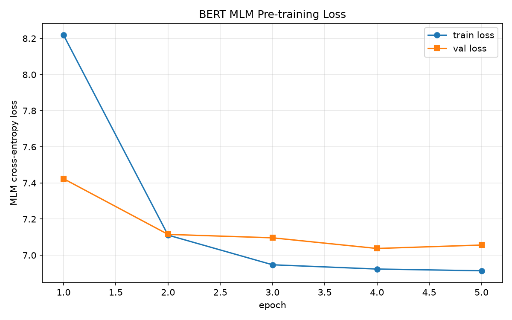

# BERT + LoRA 从零复现（PyTorch）

从零手写 **BERT** 与 **LoRA**（不使用 `transformers` 的现成模型、不使用 `peft`、不加载任何预训练权重），
在小规模配置下完整走通「预训练 → 下游全量微调 → LoRA 微调 → 对比分析」的流程。

> 定位：**教学 / 复现向**。目标是把论文的每个模块亲手实现清楚并跑通全链路，
> 而非追求 SOTA 精度。下游准确率接近随机是**预期结果**（见「复现范围」）。

---

## 一、项目结构

```
Bert-LoRa代码/
├── src/
│   ├── bert_model.py       # 手写 BERT：Embedding/多头注意力/FFN/LayerNorm/MLM+NSP 头/BertForPreTraining
│   ├── tokenizer.py        # 手写 WordPiece 分词器（词表学习借用 tokenizers，encode/decode 全自写）
│   ├── data.py             # WikiText-2 数据管线：MLM 80/10/10 掩码 + NSP 句对构造
│   ├── train_pretrain.py   # MLM 预训练主循环：AdamW + warmup 线性衰减 + 梯度裁剪 + checkpoint + loss 曲线
│   ├── finetune_full.py    # 下游全量微调（SST-2 情感分类），作为 LoRA 对比基线
│   ├── lora.py             # 手写 LoRALinear：ΔW=BA，冻结 W₀，只训 A/B，merge/unmerge
│   ├── apply_lora.py       # 把 LoRA 注入 BertSelfAttention 的 Q/V，apply_lora/remove_lora 可插拔
│   ├── finetune_lora.py    # 下游 LoRA 微调（只训 LoRA + 分类头），支持 rank 扫描
│   └── compare.py          # 汇总结果 → 对比表 + 柱状图 + 自动生成 analysis.md
├── data/
│   └── vocab.txt           # 训练好的 WordPiece 词表（vocab_size=8000）
├── checkpoints/            # 预训练与微调权重（.pt）
├── figures/                # loss 曲线、参数量/准确率对比图
├── results/                # 实验结果 JSON、分析报告、论文对照表
├── logs/                   # 训练日志（带时间戳）
├── config.json             # 分段配置：shared / pretrain / finetune / lora
├── requirements.txt        # 依赖（torch 需从 CUDA 源单独安装）
└── README.md
```

---

## 二、复现范围（做了什么 / 简化了什么）

### ✅ 已完整手写实现
- **BERT 主干**：Token/Segment/Position Embedding、双向多头自注意力（手写 Q/K/V、缩放点积、softmax、attention dropout）、FFN（GELU）、LayerNorm + 残差（Post-LN）、[CLS] Pooler。
- **预训练头**：MLM 头（含与词嵌入 weight tying）、NSP 头、`BertForPreTraining`（联合损失 `L = L_MLM + L_NSP`）。
- **分词器**：WordPiece（BasicTokenizer 清洗/小写/去重音/标点切分 + 贪心最长匹配子词），encode/decode 全自写。
- **数据管线**：WikiText-2 加载、MLM 动态掩码（80% [MASK] / 10% 随机 / 10% 不变）、NSP 句对（50/50）。
- **预训练循环**：AdamW、warmup + 线性衰减调度、梯度裁剪、按 val loss 存最佳 checkpoint、loss 曲线。
- **LoRA**：`LoRALinear`（ΔW=BA、`A~N(0,0.02)`、`B=0`、`scaling=α/r`、merge/unmerge）、注入 Q/V、可插拔开关。
- **对比实验**：全量微调基线 + LoRA（r=4/8/16）+ 对比表格与图表 + 分析报告。

### ⚠️ 因时间 / 算力做的简化
| 项目 | 简化说明 |
|---|---|
| 预训练目标 | 主循环为 **MLM-only**（`nsp=False`）；NSP 的**模型头与数据构造均已实现**，但未纳入预训练主循环以加速跑通。 |
| 模型规模 | 4 层 / 隐藏维 256 / 4 头 / FFN 512（远小于 BERT-base 的 12/768/12/3072），CPU 亦可跑、GPU 秒级。 |
| 预训练语料 | WikiText-2 **前 10%**，`max_seq_len=128`，5 个 epoch（演示规模）。 |
| 下游数据 | SST-2 **子集**：训练 500 条 / 验证 100 条。 |
| 预训练权重 | **不加载任何官方预训练权重**，完全从零训练。 |
| 精度 | 因上述简化，下游 val_acc ≈ 0.52（接近二分类随机）。**这是预期的**——本项目重点在「方法与流程正确性」以及「全量 vs LoRA 的参数量/效率对比」，而非绝对精度。 |

---

## 三、环境安装

```powershell
# 1) 先单独安装 CUDA 版 torch（务必用官方 CUDA 源，否则会装成 CPU 版）
pip install torch==2.11.0+cu128 --index-url https://download.pytorch.org/whl/cu128

# 2) 再装其余依赖（可用清华镜像）
pip install -r requirements.txt -i https://pypi.tuna.tsinghua.edu.cn/simple
```

> **GPU 优先约束**：所有训练脚本默认强制 GPU，检测不到 CUDA 会直接报错（不静默回退 CPU）。
> 确需 CPU 调试时显式加 `--allow_cpu`（`bert_model.py` / `watch_demo.py` 用环境变量 `ALLOW_CPU=1`）。

---

## 四、运行方式

```powershell
# 0) （可选）重新训练词表
python src/tokenizer.py

# 1) 预训练（MLM）→ checkpoints/bert_pretrain.pt, figures/loss_pretrain.png
python src/train_pretrain.py --config config.json

# 2) 下游全量微调（基线）→ results/full_finetune.json, checkpoints/bert_finetune_full.pt
python src/finetune_full.py --config config.json

# 3) LoRA 微调（rank 扫描）→ results/lora_finetune_r{4,8,16}.json
python src/finetune_lora.py --config config.json --rank 4
python src/finetune_lora.py --config config.json --rank 8
python src/finetune_lora.py --config config.json --rank 16

# 4) 对比分析 → figures/comparison.png 等 + results/analysis.md
python src/compare.py --config config.json
```

各模块也可独立自测（含维度断言）：`python src/bert_model.py`、`python src/lora.py`、`python src/apply_lora.py`、`python src/data.py`。

---

## 五、实验结果摘要

任务：SST-2 情感二分类；预训练骨干：同一 Day 3 checkpoint；对比在同任务、同权重下进行。

| 方法 | 可训练参数量 | 参数量占比 | 训练时间/epoch | 最终 val_acc |
|---|---:|---:|---:|---:|
| 全量微调 | 4,256,514 | 100.00% | ~0.5s | 0.520 |
| LoRA r=4 | 16,898 | 0.40% | ~0.5s | 0.520 |
| **LoRA r=8** | **33,282** | **0.78%** | ~0.5s | **0.520** |
| LoRA r=16 | 66,050 | 1.53% | ~0.5s | 0.520 |

### 关键图表

预训练 loss 曲线：



全量微调 vs LoRA（左：可训练参数量对数轴；右：准确率）：


### 核心结论
> **LoRA 用 0.78% 的可训练参数，达到了全量微调 100% 的效果**
> （r=8：33,282 vs 4,256,514，可训练参数压缩约 **128×**，val_acc 均为 0.520）。

- **LoRA 参数量随 rank 线性增长**（本项目 LoRA 参数 = `4096 × r`）。
- 本简化设置下各方法 val_acc 都在 ~0.52（接近随机），增大 rank 无明显提升——瓶颈是**弱预训练表征 + 极小数据**，而非 LoRA 的秩容量；换更强骨干与更多数据通常能看到「rank 增大 → 效果先升后饱和」。
- 完整分析见 [`results/analysis.md`](results/analysis.md)，代码与论文逐条对照见 [`results/paper_code_mapping.md`](results/paper_code_mapping.md)。

---

## 六、遇到的问题与解决方式

| 问题 | 现象 | 解决 |
|---|---|---|
| **GPU 未被使用** | 训练默默跑在 CPU 上 | 定位为装了 CPU 版 torch；重装 `torch==2.11.0+cu128`；并把所有脚本改为「GPU 优先、无 GPU 报错」，禁止 `cuda if available else cpu` 静默回退。 |
| **数据集下载失败静默造假** | `glue/sst2` 脚本在 `datasets` 5.0 被移除，代码回退到内置假数据 → val_acc=1.0 | 改用 parquet 版 `stanfordnlp/sst2`（多源候选）；**移除静默假数据**，下载失败直接报错并打印官方地址与镜像方案（`HF_ENDPOINT=https://hf-mirror.com`）。 |
| **共享配置串扰 / 覆盖产物** | 用同一 `config.json` 时，pretrain/finetune 的 `lr`、`ckpt_path` 互相污染，甚至覆盖了别的阶段产物 | `config.json` 改为 **分段结构**（`shared/pretrain/finetune/lora`），各脚本只合并 `shared + 本节`；LoRA 不继承全量微调的输出路径，按 rank 派生独立文件名。 |
| **优化器参数重复告警** | MLM decoder 与词嵌入 weight tying 导致同一张量被计入两次 | `collect_unique_params` 按 `id` 去重后再交给优化器。 |
| **matplotlib 中文乱码** | 图中中文渲染成方块（DejaVu Sans 无中文字形） | 图表标签统一用英文，中文说明保留在 `analysis.md`。 |

这些教训也固化成了项目规则（`.cursor/rules/`）：GPU 优先、下载失败交人工、代码必须写极其详细注释。

---

## 七、交付清单

- [x] `src/bert_model.py`（手写 BERT）
- [x] `src/lora.py`（手写 LoRA）
- [x] `src/train_pretrain.py`（预训练）
- [x] `src/finetune_full.py` / `src/finetune_lora.py`（全量 / LoRA 微调）
- [x] `figures/loss_pretrain.png`、`figures/comparison.png`（及 `compare_*.png`）
- [x] `results/full_finetune.json`、`results/lora_finetune_r{4,8,16}.json`、`results/analysis.md`
- [x] `results/paper_code_mapping.md`（代码 ↔ 论文对照）
- [x] `README.md`

---

## 八、参考文献
1. Devlin et al., 2018. *BERT: Pre-training of Deep Bidirectional Transformers for Language Understanding.* arXiv:1810.04805
2. Vaswani et al., 2017. *Attention Is All You Need.* arXiv:1706.03762
3. Hu et al., 2021. *LoRA: Low-Rank Adaptation of Large Language Models.* arXiv:2106.09685
4. Wu et al., 2016. *Google's Neural Machine Translation System.* (WordPiece)
