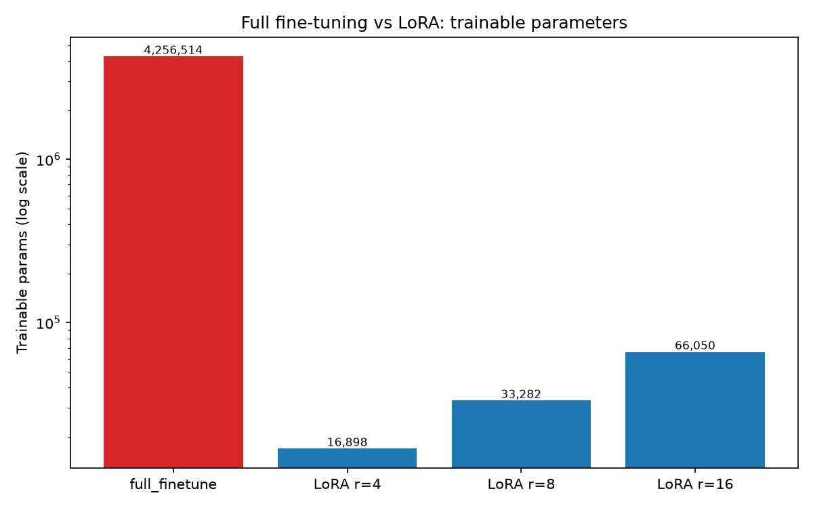
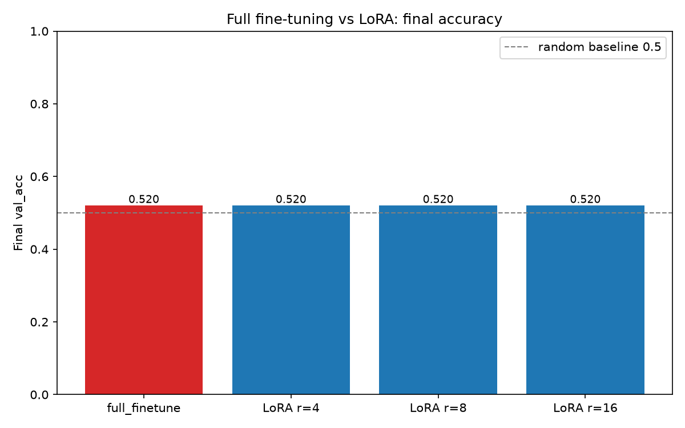
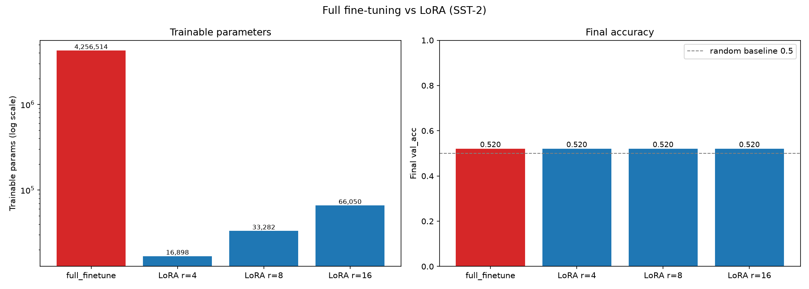

# 全量微调 vs LoRA 对比分析（Day 6）

任务：SST-2 情感二分类；预训练骨干：Day 3 checkpoint；对比在同一任务、同一预训练权重下进行。

## 对比表

| 方法 | 可训练参数量 | 参数量占比 | 训练时间/epoch | 最终 val_acc |
|---|---:|---:|---:|---:|
| full_finetune | 4,256,514 | 100.00% | 0.54s | 0.5200 |
| LoRA r=4 | 16,898 | 0.40% | 0.46s | 0.5200 |
| LoRA r=8 | 33,282 | 0.78% | 0.47s | 0.5200 |
| LoRA r=16 | 66,050 | 1.53% | 0.46s | 0.5200 |

## 图表

## 分析结论

1. **LoRA 用极少参数达到与全量微调相当的效果**：以 LoRA r=8 为例，仅训练 **33,282** 个参数（占全模型 **0.78%**），相较全量微调的 **4,256,514**，可训练参数压缩约 **128×**；其 val_acc=0.5200，与全量微调 val_acc=0.5200 的差距仅 **+0.0000**。这验证了 LoRA 论文的核心论断：用远少于全量微调的参数即可获得可比效果。

2. **rank 大小的影响趋势**：可训练参数量随 rank 近似线性增长（本项目 LoRA 参数 = 4096 × r），但准确率趋势为「r=4: 0.5200、r=8: 0.5200、r=16: 0.5200」。在本「小模型（4 层/256 维）+ 仅 10% WikiText-2 预训练 + 500 条训练样本」的设置下，各方法的 val_acc 都接近二分类随机水平（~0.5），增大 rank 未见明显提升——说明此处的性能瓶颈是**预训练表征质量与数据规模**，而非 LoRA 的秩容量。若换用更强的预训练骨干与更多数据，通常可见到「rank 增大 → 效果先升后饱和（收益递减）」的趋势。

3. **效率**：各方法每 epoch 训练时间接近（同样走一遍前向/反向），LoRA 的主要收益体现在**可训练参数量**与**优化器状态显存**上，而非单步计算时间；在大模型上，可训练参数骤减会显著降低显存占用与 checkpoint 体积。
